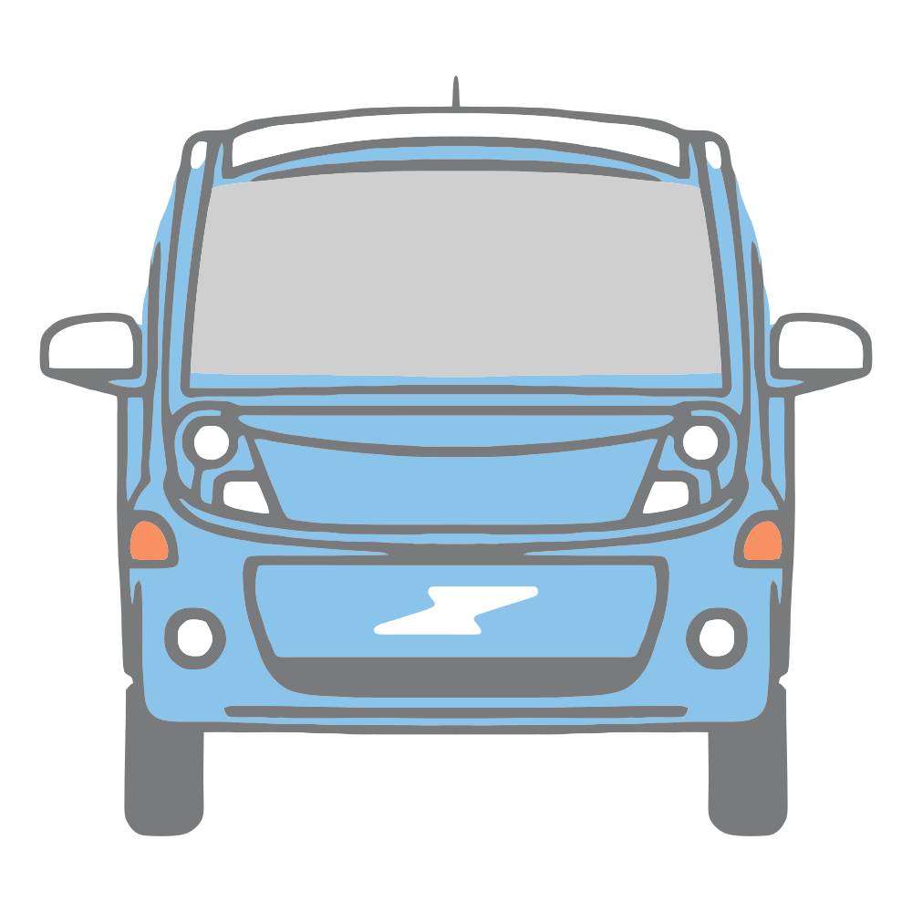

# Mitsubishi i-MiEV Battery Upgrade

> [!NOTE]
> This is an unofficial guide created by community members. We are not affiliated with, endorsed by, or connected to Mitsubishi Motors Corporation in any way. "Mitsubishi" and "i-MiEV" are registered trademarks of Mitsubishi Motors Corporation. All trademarks are the property of their respective owners.

## Prerequisites

-   high-voltage safety knowledge and equipment
-   basic mechanical and electrical skills
-   [Arduino Due](https://docs.arduino.cc/hardware/due/) or [CANFDuino](https://github.com/togglebit/CANFDuino) for CAN spoofing ( US reseller](https://copperhilltech.com/arduino/) )
-   proper tools and workspace ( TODO expand )

## Materials

### Battery Cells

> [!WARNING]
> NMC cells will be permanently damaged if charged (including regenerative braking) below 0°C (32°F). See [battery_chemistries.md](battery_chemistries.md) for more details and mitigation strategies.

- 88x (or 80x for post-2012 iOn/C-Zero) CATL NMC 93Ah cells with M8 terminals recommended
- Alibaba sources: [1](https://www.alibaba.com/product-detail/Starmax-High-Power-Catl-3-7V_1600752172388.html) [2](https://www.alibaba.com/product-detail/Brand-New-CATL-Ternary-Lithium-Ion_1600494889608.html) [3](https://www.xihobattery.com/products/catl-93ah-37v-nmc-prismatic-rechargeable-lithium-ion-battery) [4](https://www.alibaba.com/product-detail/subject_1600869468591.html)

### Hardware

- cork/felt/corrogated plastic spacers for cell height adjustment ([details](https://5by9.net/prune_batteries/module_rebuild.html))
- bus bars and jumper materials, either machined or diy
  - machined (3.2mm thick 6061 aluminum without tapped holes from SendCutSend)
    - 76x [l-shaped bus bar for 1233mm ctc battery cell](https://www.printables.com/model/1036239-l-shape-bus-bar-for-1233mm-ctc-battery-cell)
    - 24x [i-shaped bus bar for 1233mm ctc battery cell for mi](https://www.printables.com/model/1036252-i-shape-bus-bar-for-1233mm-ctc-battery-cell-for-mi)
  - diy (follow 5by8.net guide)
    - [https://www.amazon.com/gp/product/B0BBDTQVYP/](https://www.amazon.com/gp/product/B0BBDTQVYP/?tag=forumyield-20)
- Arduino Due or CANFDuino with CAN shields
- wiring and connectors for CAN bridge

### Step-by-step process​

## Battery Pack Removal  

Follow the detailed guide at [https://5by9.net/prune\_batteries/pack\_removal.html](https://5by9.net/prune_batteries/pack_removal.html) .

## Module rebuilding  

- Follow the detailed guide at [https://5by9.net/prune\_batteries/module\_rebuild.html](https://5by9.net/prune_batteries/module_rebuild.html) .
- Key steps include:
  - disassembling modules
  - modifying plastic cell holders
  - installing new cells with proper spacing
  - making/installing bus bars and jumpers
  - reconnecting CMU boards

## CAN bridge setup  

- Install Arduino Due or CANFDuino
- Download latest code from [can_bridge.ino](can_bridge.ino)
- Connect to vehicle:
  - CAN0 to BMU pins 6 & 7
  - CAN1 to ECU
  - power from switched 12V

## Testing & validation  

- Check all connections and voltages.
- Verify CAN communication.
- Test drive and monitor performance.

## Important Notes

- **WARNING**: NMC cells will be permanently damaged if charged (including regenerative braking) below 0°C (32°F). See [battery_chemistries.md](battery_chemistries.md) for more details and mitigation strategies.
- Always follow proper high voltage safety procedures.
- Take time to properly balance cells before installation if there are any that have varying voltages connect in parallel for a few days.
- Document original wiring and connections.
- The CAN bridge code is still being refined and improved.

## See also
- https://openinverter.org/wiki/CAN_bus_with_Arduino_Due : Arduino CAN basics
- https://savvycan.com/ : FOSS CAN sniffing software
- https://github.com/collin80/can_common : FOSS can library
- https://github.com/collin80/due_can : FOSS C++ canbus library for Arduino Due compatible boards
