> [!TIP]
> This file was adapted from https://5by9.net/prune_batteries/mitm.html

# Man in the Middle

These are instructions for inserting a microprocessor in the CAN bus (a CAN bridge) between the BMU (battery monitoring unit) and EV-ECU (electric vehicle electronic control unit) that intercepts and modifies packets so that the car accepts the new, larger battery pack, accurately reports the state of charge, and utilizes the increased capacity.

## Code

The [CANFDuino](https://togglebit.net/product/canfduino/) was programmed with my ported version of Paul Dove's ([piev](https://myimiev.com/members/piev.2638/)) Arduino\_19.ino. The port was done brute force and no attempt was made to reformat and comment the code to improve the documentation and facilitate future maintenance since the future of Arduino\_19.ino is unknown. My CANFDuino ported version is named [MITM\_19.ino](MITM_19.ino) and has been running successfully in my car since August 2024 (10 months at time of writing).

Compiling and loading the MITM\_19.ino source code follows conventional Arduino programming instructions and CANFDuino documentation found elsewhere (e.g., see the How To's menu or Resources section on the [CANDFDuino product page](https://togglebit.net/product/canfduino/)).

## Hardware Installation

i-MiEV component locations and wiring is best explored using the [shop manual](https://web.archive.org/web/20240918073757/http://mmc-manuals.ru/manuals/i-miev/online/Service_Manual/2012/index_M1.htm).

The CANFDuino was provisioned by adding some circuits to the external terminal strip.

The CANFDuino connections are as follows:

<table><tbody><tr><td>Terminal 12</td><td>Wired to internal "GND" pad. Chassis ground.</td></tr><tr><td>Terminals 1-2</td><td>Wired to internal "NO BOOT" pads. Jumpered for fast boot normal operation. Open for programming. </td></tr><tr><td>Micro USB</td><td>5 volt power, or computer for programming.</td></tr><tr><td>CAN0</td><td>DB9 BMU connection, internally terminated.</td></tr><tr><td>CAN1</td><td>DB9 i-MiEV CAN bus connection, not internally terminated. Gender bender attached to convert to female DB9.</td></tr></tbody></table>

The car's CAN bus was severed near the BMU. A 6" pigtail was attached to the the BMU side that terminated in a female DB9 connector. A similar pigtail was attached to the bus side which terminated in a male DB9 connector. This was done so these two pigtails could be plugged together to bypass the CANFDuino bridge if necessary.

The switched 12V supply to the BMU was tapped to power a small [DC to DC buck converter](https://www.amazon.com/dp/B0BXSGL4QX) to supply 5 volts through the Micro USB CANFDuino socket any time the BMU was powered up.

The CANFDuino terminal 12 was connected to the car frame.

## Wiring Diagrams

1.  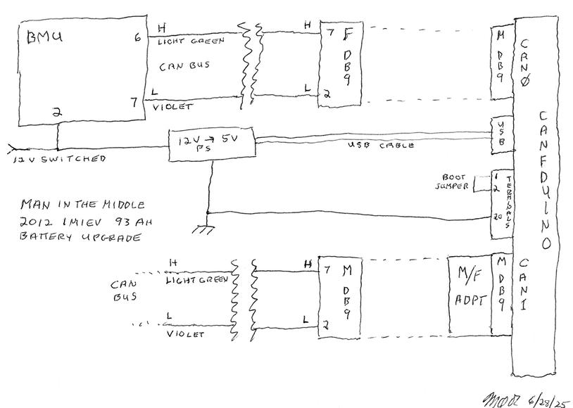
    
    Man in the middle wiring diagram.
    
2.  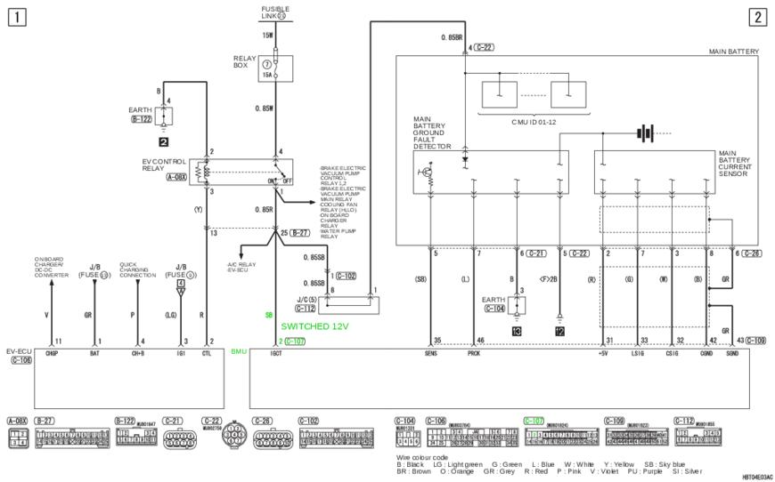
    
    Vehicle schematic showing 12 volt switched power (highlighted in green). Note that the yellow wire color on our vehicle did NOT match the diagram's sky blue.
    
    [Original diagram.](https://web.archive.org/web/20250707125914/http://mmc-manuals.ru/manuals/i-miev/online/Service_Manual/img/90/HBT04E03AC00ENG.pdf)
    
3.  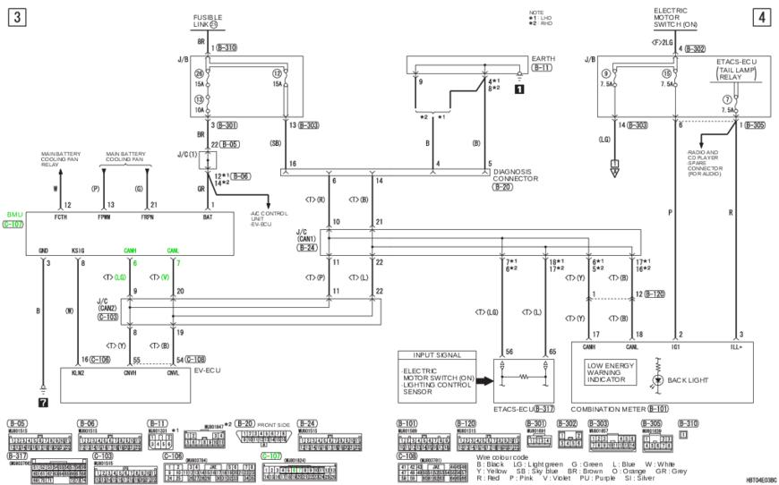
    
    Vehicle schematic showing BMU CAN bus connections (highlighted in green).
    
    [Original diagram.](https://web.archive.org/web/20250707125932/http://mmc-manuals.ru/manuals/i-miev/online/Service_Manual/img/90/HBT04E03BC00ENG.pdf)
    

## Photos

1.  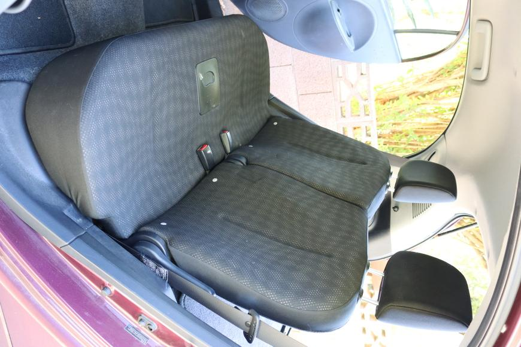
    
    BMU is located on the left side under the rear seat cushion. [Cushion removal instructions.](http://mmc-manuals.ru/manuals/i-miev/online/Service_Manual/2012/52/html/M152200180075801ENG.HTM)
    
2.  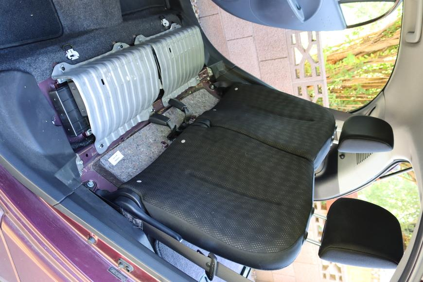
    
    Rear seat cushion removed. BMU is under the left cover.
    
3.  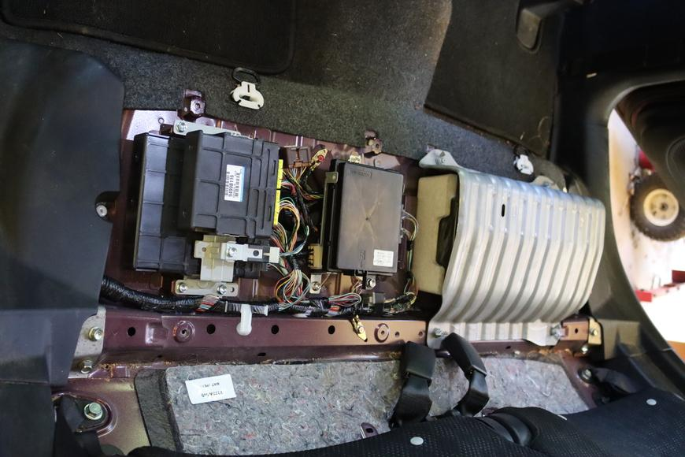
    
    Cover removed.
    
4.  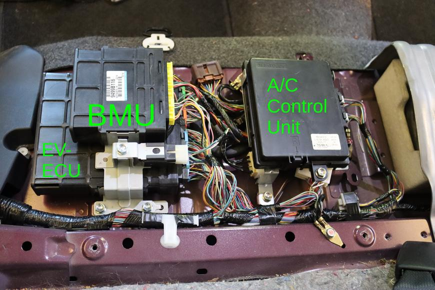
    
    Location of the BMU. See also this [diagram](http://mmc-manuals.ru/manuals/i-miev/online/Service_Manual/img/70/AC901055AC00ENG.pdf).
    
5.  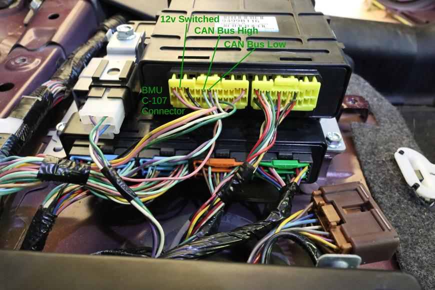
    
    Location of the wires for 12v switched (pin 2, yellow), CAN bus high (pin 6, light green), and CAN bus low (pin 7, violet) at the BMU C-107 connector.
    
6.  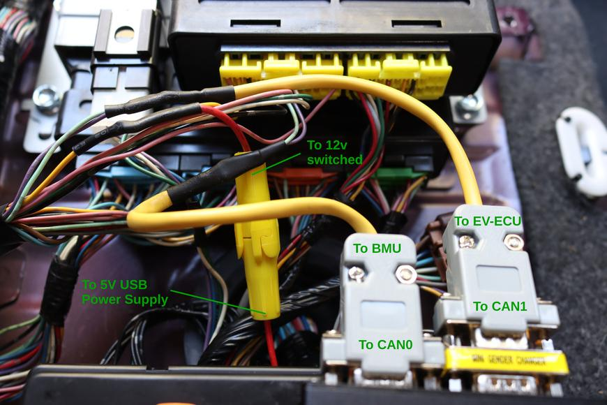
    
    CAN bus wires (light green and violet) cut and DB9 pigtails spliced in between. USB power supply also tapped in to switched 12v (yellow). In-line fuse added for the USB power supply.
    
7.  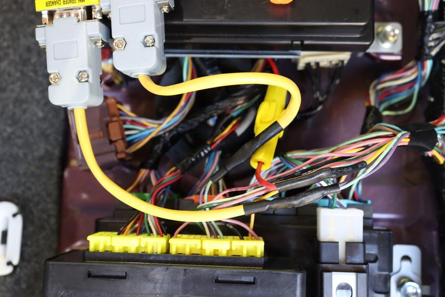
    
    Alternative view for wiring clarity.
    
8.  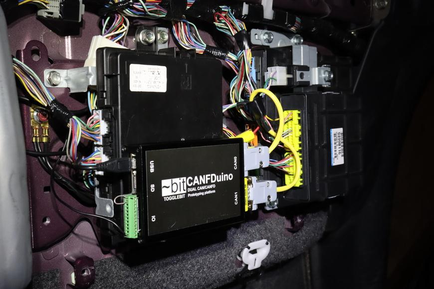
    
    CANFDuino wired and mounted with hook and loop to the A/C Control Unit, where there is space. USB power supply (not visible) fits under the A/C Control Unit.
    
9.  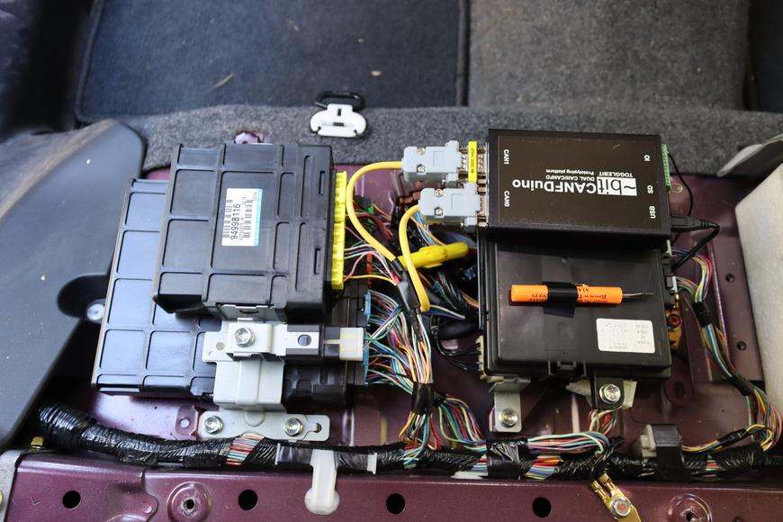
    
    Final installation.
    
10.  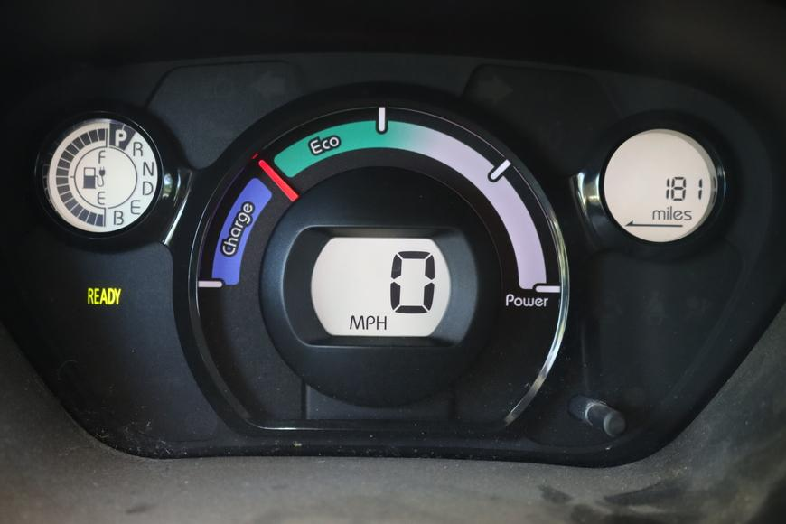
    
    Vehicle sees the increased capacity of the upgraded batteries and estimates range remaining accordingly.