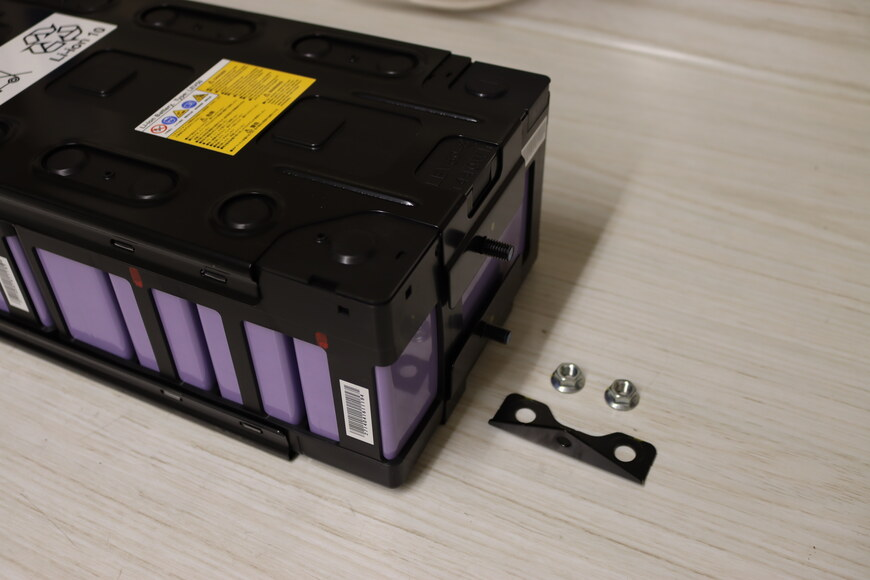
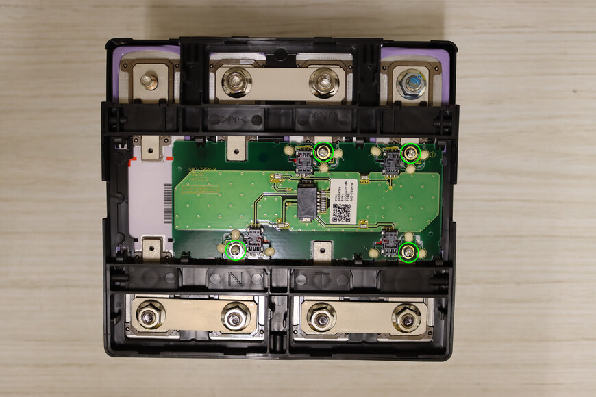
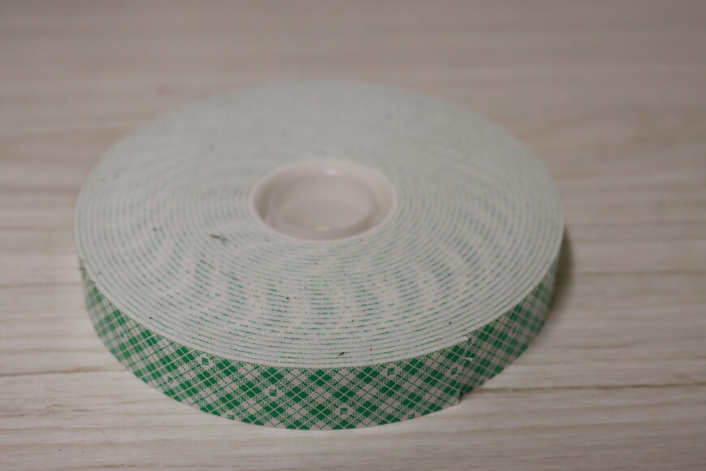
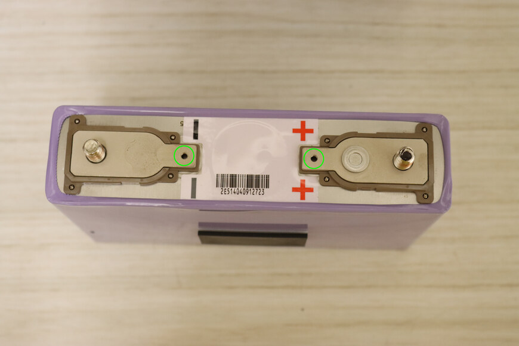

# i-MiEV: Fitting 94ah NMC Batteries in the Pack

This guide shows how an i-MiEV pack was rebuilt, replacing the 50ah LEV50s with [94ah NMC batteries](https://www.alibaba.com/product-detail/Brand-New-CATL-Ternary-Lithium-Ion_1600494889608.html?spm=a2700.wholesale.0.0.256e30b1jevR7c).

Challenges: The 94ah NMC batteries have a slightly different form factor and terminals that must be adapted to fit in the pack.

Old 50ah LEV50.

New 94ah NMC. Note the M8 terminals (custom ordered instead of the default M6) to match the LEV50.

The LEV50 (left) and NMC (right) have slightly different form factors. The NMC is slightly narrower than the LEV50.

The NMC (foreground) is shorter than the LEV50 (background).

The NMC (top) is slightly longer than the LEV50 (bottom).

## Procedure

> [!WARNING]
> The pack contains high voltages and high current sources that may result in property damage, serious injury, or death. Adhere to the [PRECAUTIONS ON HOW TO USE THE HIGH-VOLTAGE VEHICLE](https://web.archive.org/web/20241222211352/http://mmc-manuals.ru/manuals/i-miev/online/Service_Manual/2017/54/html/M154940710001501ENG.HTM) and other safety recommendations in the [service manual](https://web.archive.org/web/20241223155351/http://mmc-manuals.ru/manuals/i-miev/online/Service_Manual/2017/index_M1.htm). Do not attempt the upgrade procedure if not trained/qualified, experienced, and comfortable working with high voltage, high current systems.

### Initial Disassembly

1. See the [service manual](https://web.archive.org/web/20241223155351/http://mmc-manuals.ru/manuals/i-miev/online/Service_Manual/2017/index_M1.htm) for instructions on removing and opening the pack

    The pack consists of ten 8-cell modules and two 4-cell modules. An 8-cell module consists of two 4-cell modules. For this document, these will be referred to as modules (8 cells) and submodules (4 cells).

    It is recommended to reinstall each rebuilt module in the same location from which it was removed in the pack. This avoids potentially needing to reprogram the BMU due to moving the CMUs. Consider numbering the modules and submodules before removal, or only removing and rebuilding a single module at a time, to ensure the modules are reinstalled in the same location from which they were removed in the pack.

    1. 

        An 8-cell module removed from the pack.

2. It is recommended to mark the positioning of the positive terminals before opening the module. This will ease assembly and reduce the chance of making a polarity error that might destroy the CMUs.

    A paint pen or nail polish work well for marking the positive ends.

    1. 

        Positive ends of cells marked before further disassembly.

3. Remove the mounting brackets holding the metal clam shell together.

    1. 

        Left bracket (connector side) removed.

    2. 

        Right bracket removed.

4. Remove the top metal clam shell by prying it over the 8 plastic tabs.

    1. 

        Plastic tabs holding on the metal clam shell.

    2. 

        Close up of two of the tabs.

    3. 

        Top metal clam shell removed.

5. Pry off the plastic top cover, which is held on by tabs.

    1. 

        Plastic cover removed.

6. Remove the cable between the CMU and daughter board.

    1. 

        Cable between the CMU and daughter board. Depress the tab (circled) to separate the plug from the socket. Repeat on the other end.

    2. 

        Cable removed.

7. Remove the bus bar between the two submodules.

    1. 

        Remove the bus bar linking the two submodules.

    2. 

        Bus bar removed.

8. Remove the bottom metal clam shell by prying it over the 8 plastic tabs.

    1. 

        Plastic tabs holding on the metal clam shell.

    2. 

        It may be helpful to place the module on its side to free the battery cage from the clam shell so as not to be fighting against gravity.

    3. 

        Bottom clam shell removed.

### CMU and Battery Removal

1. Remove the 4 screws attaching the CMU daughter board to the batteries.

    > [!WARNING]
    > The circuit board is delicate. By comparison, the batteries have great mass. The reason for removing the screws now is so that any movement/shiftage of the batteries during disassembly doesn't result in a force that is transferred to and breaks the circuit board.

    1. 

        Remove the four circled screws.

    2. 

        Screws removed.

2. Remove the top webbing of the battery cage.

    Note that there is adhesive at the circular points. Care must be taken to avoid breaking the plastic when severing the adhesive.

    1. 

        There is adhesive at the circular points.

    2. 

        Care must be taken when slicing the adhesive at the circular points (green circle) not to sever the nearby locating tab (red circle).

    3. 

        A putty knife with light tapping can be used to cut the adhesive without breaking the plastic.

    4. 

        Wedge the putty knife between the two pieces of plastic at an adhesion point. Gently tap the putty knife to cut the adhesive. Repeat for the remaining 6 (total 7) adhesion points

    5. 

        Remove the top webbing, which is now only held on by plastic tabs.

3. Remove the batteries from the cage.

    Push the cells out from the bottom. The batteries are a very tight fit and it will take some force. Tape and rubber spacers between the batteries mean all four batteries will likely move as an unit.

    1.  
        
        To start the batteries moving, it may be helpful to flip the cage upside down, block up the edges of the cage, and push the bottom of the batteries down.
        
    2.  
        
        The high coefficient of friction on the rubber spacers means the batteries will likely move as an unit.
        
    3.  
        
        Batteries removed.
        
### Battery Cage Preparation

1. Mark the polarity on the inside of the battery cage. This will ease in reassembly and reduce the probability of an error.

    1. 

        Extend the polarity marks on the outside of the battery cage to the inside.

2. Mark the polarity on the new batteries. This will ease in reassembly and reduce the probability of an error.

    1.  

        Polarity is not well-marked on the new terminals.
        
    2.  
        
        A paint pen or nail polish work well for marking the polarity.
        
3. Remove ~2mm on each side of the battery cage base to accommodate the slightly longer, NMC batteries.

    A snug fit is OK, as the batteries shouldn't rattle around. Too tight and there is danger of breaking the plastic cage or tearing the outer insulation of the battery when inserting.
    
    1.  
        
        The new NMC batteries are slightly longer and don't fit in the base of the battery cage.
        
    2.  
        
        Battery overhang on left.
        
    3.  
        
        Battery overhang on right.
        
    4.  
        
        Material removal area.
        
    5.  
        
        A Dremel or rotary tool with a deburring bit can be used to remove the material.
        
    6.  
        
        Deburring bit.
        
    7.  
        
        1-2mm of material removed. Repeat on the opposite side.
        
    8.  
        
        Test fit.
        
    9.  
        
        Note the top of the battery lines up with a top line on the battery cage.
        
    10.  
        
        Flip the battery cage over and verify that the battery fully inserts to the bottom of the cage.
        
    11.  
        
        Battery seated with no space between the bottom of the battery and the cage.
        
4. Add spacers to the bottom of the battery cage to elevate the new, shorter batteries 4mm.

    1.  
        
        Corrugated plastic is available in 4mm thickness and has some other nice properties: easy to cut, allows air circulation for cooling, and can often be obtained for free (as discarded sign boards from elections, etc.).
        
    2.  
        
        Side view of corrugated plastic.
        
    3.  
        
        Eight 1 3/4" x 3/8" and four 1 3/4" x 1 1/4" spacers are needed for each cage.
        
    4.  
        
        Use double-sided tape to affix the spacers to the bottom of the battery cage.
        
    5.  
        
        Locations for spacers.
        
    6.  
        
        Spacers installed.
        
    7.  
        
        Battery installed on spacers.
        
    8.  
        
        Battery now sits slightly above the line in the battery cage.
        
### New Battery Installation

1. Affix 4mm spacers between the batteries.

    1. 

        Three 1 1/2" x 1 1/2" spacers are needed for each set of four batteries.

    2. 

        3/4" wide foam-backed double sided tape.

    3. 

        Shape of the spacer isn't critical. 1 1/2" x 1 1/2" was chosen as having approximately the same surface area (right) as the original spacer (left), while being a multiple of the 3/4" tape, which was the most economical to purchase.

2. Install the batteries in the battery cage. Pay attention to polarity.

    1. 

        Ensure the batteries are fully seated and polarity is correct. Note the spacers between the batteries.

3. Fabricate jumpers to attach the CMU to the batteries.

    Note: These jumpers serve as both electrical conductors for measuring the battery voltage and thermal conductors for measuring the battery temperature.

    1. 

        The LEV50s have an extra set of mounting holes, used to attach the CMU electrically and thermally to the battery.

    2. 

        Bus bars were used to construct the jumpers. The 56mm length permitted the construction of a jumper, and a washer from the waste. The 6mm slots had to be ground out for the M8 terminals, as bus bars with 8mm slots weren't readily available.

    3. 

        Jumpers and washers (top) were fabricated out bus bars (bottom). These were cut with a hack saw and then sanded to remove flashing and ensure good electrical contact for the high current application. The hole was tapped as an M3 x 0.5 to match the threads of the existing screws.

    4. 

        Jumper installed on the new battery (bottom) to provide the connection to the CMU. Old battery (top) shown for comparison. Washer also installed on the new battery as a spacer, so that both terminals are the same height.

### CMU and Bus Bar Installation

1. Install jumpers and washers on battery terminals.

    > [!WARNING]
    > Take care that the jumpers do not rotate and touch adjacent battery terminals, as this could cause a short circuit.

    1. 

        Orient the CMU daughter board and battery cage based on the cut outs for the terminals. Add jumpers on the terminals that connect to the CMU board. Add washers on the remaining terminals.

    2. 

        Tip: Nuts can be tightened against the jumpers temporarily to keep the jumpers from rotating and shorting to adjacent terminals when the webbing is installed in the subsequent step.

2. Install the plastic webbing and CMU on the battery cage.

    > [!WARNING]
    > Take care that the jumpers do not rotate and touch adjacent battery terminals and cause a short circuit during this process. Once the webbing is on, the jumpers will no longer be able to touch adjacent terminals.

    1. 

        Plastic webbing with CMU daughter board installed on battery cage.

3. Align the jumpers with the holes in the CMU board and start the screws.

    > [!WARNING]
    > Do not tighten the screws yet to avoid transferring forces to the delicate board during the next steps of reassembly.

    > [!WARNING]
    > With the webbing positioned via the plastic positioning tabs, the top of the jumpers should align with the bottom of the CMU board. If not, it may be necessary to adjust the shimming of the batteries. Non-neutral positioning may result in breaking the board later when the screws are tightened.

    1. 

        Align the threaded holes on the jumpers with the CMU board holes. A nut, no tighter than finger tight, can be used on the terminal to hold the jumper in place if necessary.

    2. 

        Floating tabs on the circuit board allow for slight, independent movement of the batteries from the board. These are delicate. Too much stress or movement and these will break. Shown here mounted to the original LEV 50.

    3. 

        View of the floating tab from the back side of the circuit board (not visible at this point in assembly).

    4. 

        Screws installed but not tightened.

4. Install the three bus bars and 6 nuts; tighten to specification.

    > [!WARNING]
    > Do not tighten a nut on a jumper unless there is a bus bar installed to prevent the torque from transferring to the jumper and the delicate CMU board.
    
    1.  
        
        Install bus bars and nuts.
        
5. Tighten the CMU screws. Watch for the circuit board being stressed while tightening. Stop and adjust/realign if necessary to avoid breaking the delicate board.

    > [!WARNING]
    > Do not tighten a CMU screw unless the jumper is well-supported (bus bar and nut, or just nut) on the battery terminal end. Else, the jumper will tilt down and stress the CMU board. If adding a terminal nut directly on top of a jumper, tighten only to finger tight to avoid transferring a large torque to the CMU board via the jumper.
    
    1.  
        
        Add a terminal nut (finger tight only) to the unsupported jumper to prevent the jumper from tilting down and stressing the circuit board while tightening the screw.
        
### Testing and Verification

1. Measure the voltage of the submodule.

    1. 

        Voltage will depend on the state of charge of the cells, but should be approximately 4 \* 3.7 volts = 14.8 volts.

2. Rebuild the second submodule in the same fashion.

    1. 

        Note that the CMU main board uses 5 jumpers instead of 4.

### Final Assembly

1. Reinstall the bottom clam shell on both submodules.

    1. 

        Note the positioning and orientation of the submodules and clam shell.

    2. 

        Bottom clam shell installed.

2. Reinstall the cable between the CMU main board and daughter board.

    1.  

        Installing the jumper cable.
        
3. Reinstall the bus bar between the two submodules. Tighten nuts according to specification.

    1.  
        
        Install the bus bar between the two submodules.
        
4. Reinstall the plastic cover.

    1.  
        
        Plastic cover reinstalled.
        
5. Check the voltage of the module.

    1.  
        
        Voltage will depend on the state of charge of the batteries, but should be approximately 8 \* 3.7 = 29.6 volts.
        
6. Reinstall the top metal clam shell.

    1.  
        
        Top clam shell snapped onto the plastic tabs.
        
7. Reinstall the mounting brackets to hold the top and bottom clam shells together.

    Oversize holes result in the brackets having play on the studs, so it is recommended to not tighten the bracket nuts until fitting the module back into the pack.
    
    1.  
        
        Left bracket (connector side) reinstalled.
        
    2.  
        
        Right bracket reinstalled.
        
8. Reinstall the module in the pack, making sure to tighten the bracket nuts if they were left loose in the previous step.
