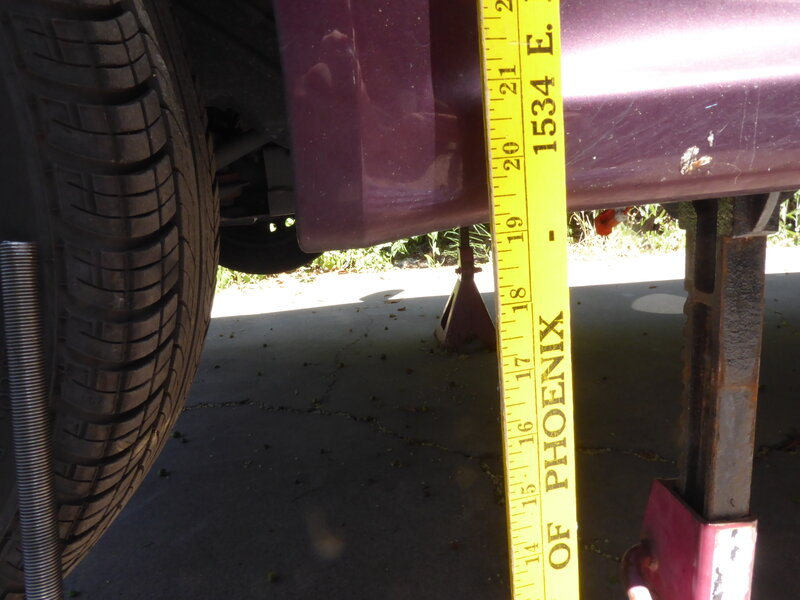
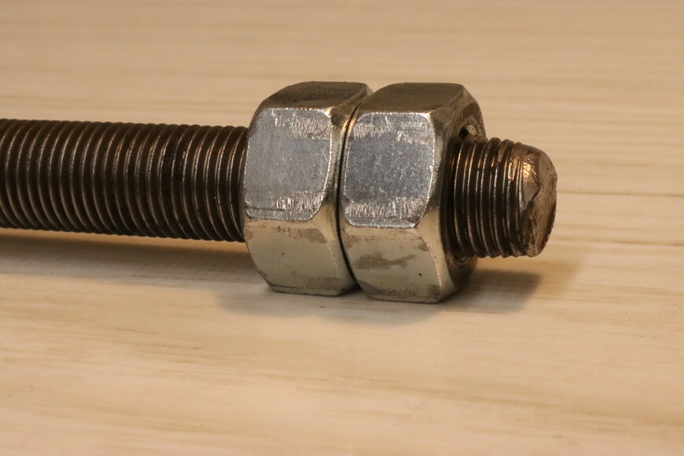

# Pack Removal

The following describes a method to remove and reinstall the i-MiEV's traction battery pack safely and easily without the use of a vehicle lift.

## Procedure

### Vehicle Preparation
1. Lift the vehicle and support it on jack stands.
    
    See the [SUPPORT LOCATIONS FOR LIFTING AND JACKING](https://web.archive.org/web/20241204221109/http://mmc-manuals.ru/manuals/i-miev/online/Service_Manual/2017/00/html/M100100070122301ENG.HTM) for safe lift and support points.
    
    In order for the traction battery pack to clear the body, the vehicle must be lifted significantly.
    
    > **Warning**  
    > The traction battery pack weighs ~500 pounds. Ensure that the vehicle is well-supported and the jack stands spread widely (both left-right and front-back) so that the car does not shift when removing or installing the pack.
    
    1.  
        
        Front of vehicle lifted so rocker panel is 19.25" above the ground, which was the limit of the jack stands.
        
    2.  

        Rear of vehicle lifted so rocker panel is 21" above the ground, which was the limit of the jack stands (supported at rear axle, not shown in photo).
        
### Electrical Disconnection
2. Follow the [TRACTION BATTERY REMOVAL AND INSTALLATION](https://web.archive.org/web/20241204221210/http://mmc-manuals.ru/manuals/i-miev/online/Service_Manual/2017/54/html/M154940130021501ENG.HTM) instructions in the service manual to:
    1. Disconnect the 12 volt auxiliary battery.
    2. Disconnect the traction battery pack service plug.
    3. Remove the front and rear traction battery pack splash shields.
    4. Disconnect cables to the traction battery pack.

### Pack Support Installation
3. Remove four of the traction battery pack mounting bolts and replace them with threaded rods and nuts.
    
    1.  
        
        Remove the four traction battery pack mounting bolts at the circled mount points (shown here from the top with the pack removed).
        
    2.  
        
        Obtain four [M12-1.25 threaded rods](https://www.clipsandfasteners.com/M12-1-25-x-1-Meter-Threaded-Rod-Class-4-6-Plain-p/bi-v34127.htm) that are approximately 0.5 meters long, a minimum of 6 [M12-1.25 nuts](https://www.clipsandfasteners.com/12mm-1-25-Din-934-Hex-Nut-Zinc-p/a14458.htm), and four fender washers.
        
    3.  
        
        Replace each of the four removed traction battery pack mounting bolts with a threaded rod, washer, and nut. Ensure the rods are sufficiently threaded into the holes in the body to hold the weight of the pack. Snug the nuts so the threaded rod is supporting the traction battery pack.
        
    4.  
        
        Front traction battery pack mounting bolt replaced with threaded rod, washer, and nut.
        
    5.  
        
        Rear traction battery pack mounting bolt replaced with threaded rod, washer, and nut.
        
    6.  
        
        If the rods can't be hand threaded into the body, two nuts can be locked against each other on the other end of the rod; the locked nuts can then be used to turn the rod into the body with a wrench.
        
    7.  
        
        Optional: Include a spacer between the washer and nut (concept shown in inset using an 1/2 inch drive socket) to move the nut below the box beam. This will make it easier to turn the nut by allowing a wrench to move through a full 360 degrees.
        
### Pack Lowering
4. Remove the remaining 6 traction battery pack mounting bolts; the pack will remain in place, supported by the threaded rods and nuts.
    
5. Lower the pack by loosening the nuts.
    
    It is recommended to run all four nuts down the rods in small increments to keep the pack approximately level.
    
    > **Warning**  
    > Ensure that the rod does not turn and unthread from the body when turning a nut. If the rods can't be held from turning by hand, [lock two nuts](https://5by9.net/prune_batteries/pack_removal.html#lock-two-nuts) against each other and hold with a wrench.
    
    1.  
        
        Pack partially lowered. This will be a slow process due to the fine thread on the rods. A ratcheting box wrench is helpful, but still an interference fit with the box beam. If a [spacer was added](https://5by9.net/prune_batteries/pack_removal.html#spacer) in the previous step to lower the nut below the box beam (not shown in photo), a wrench can be turned 360 degrees, which should expedite the process.
        
6. Optional: Use a jack to expedite lowering the pack.
    
    Iteratively supporting the weight of the pack with a jack, spinning down the nuts by hand, and then lowering the pack with the jack to the nuts may be faster.
    
    1.  
        
        Optional: Use a jack and a 2x4 to slightly lift the pack off the nuts. This allows hand spinning down the nuts, which is much faster than turning the nuts with a wrench under load, while still keeping the descent controlled. It may take several attempts to find the balance point when lifting with the jack (balance point is slightly towards the rear of the pack). Alternatively, multiple jacks can be used to avoid the balancing issue. For a controlled descent, lift the pack off the nuts, spin the nuts down a few inches, lower the pack onto the nuts, and repeat.
        
### Final Removal
7. Lower the pack onto dollies.
    
    1.  
        
        When approaching the height of the dollies, insert them under the pack. Two [Franklin 30 x 18 inch dollies](https://www.harborfreight.com/30-in-x-18-in-1000-lb-capacity-hardwood-dolly-58316.html) were used.
        
    2.  
        
        Pack resting on dollies. Nuts backed off so the threaded rods are no longer holding any weight.
        
8. Remove the rods from the body.
    
    1.  
        
        Unscrew the rods from the body once they are no longer holding weight.
        
    2.  
        
        Depending on the height of the jack stands, height of the dollies, and length of the rods, it may be necessary to temporarily lift the vehicle a small amount to get the clearance to remove the rod. Shown here with rear elevated an inch or two more with the jack.
        
    3.  
        
        Rear rod removed and vehicle lowered back on to jack stands. It can be seen that the rod was slightly too long to remove without further lifting the vehicle.
        
9. Roll the pack out from underneath the vehicle.
    
    1.  
        
        Tilt the rods so they clear the body of the vehicle.
        
    2.  
        
        Roll the pack out from underneath the vehicle, watching carefully for interference.
        
    3.  
        
        Pack removed.
        
### Reinstallation
10. Reinstall the pack by follow the same steps in reverse order.
